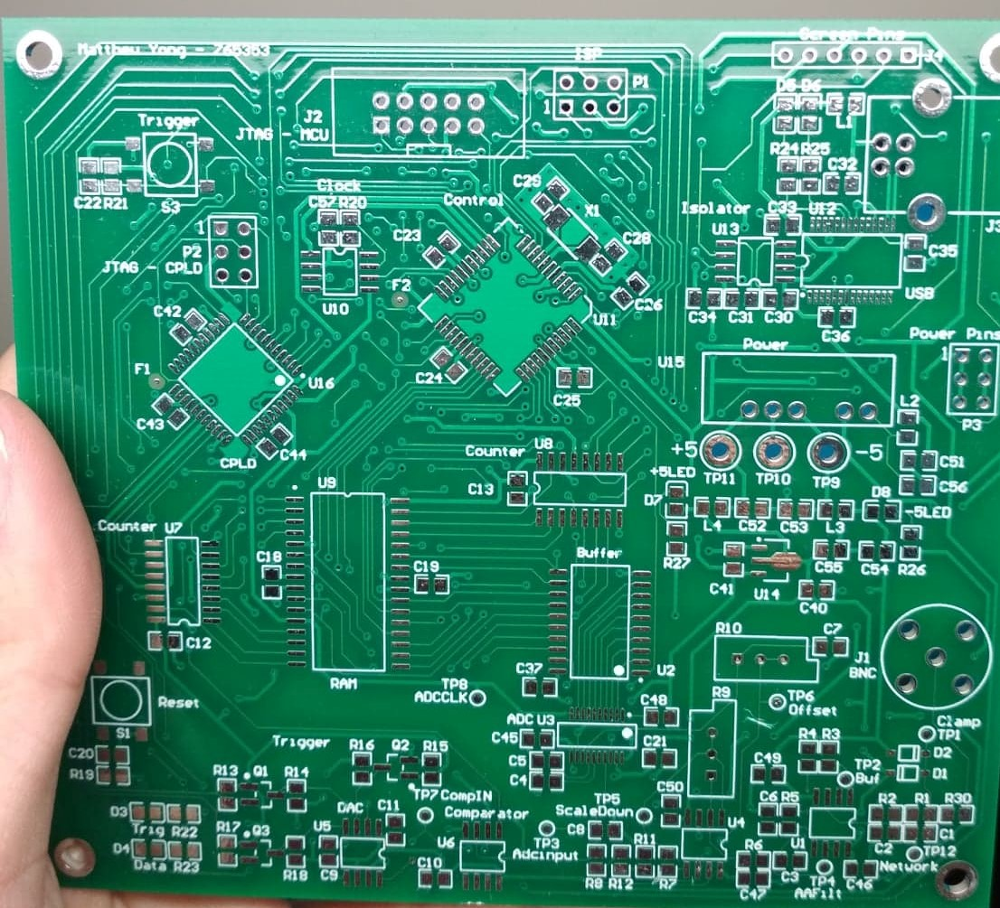

# DSO2019
Repository of a self-made Digital Oscilloscope Project. Guided by ELEN90053 Electronic System Design subject at the University of Melbourne. 

# Table of Contents
  * [Main Features:](#main-features-)
  * [Subsystems](#subsystems)
  * [System Block Diagram](#system-block-diagram)
  * [PCB Design](#pcb-design)
  * [How it works](#how-it-works)

## Main Features:
- Printed Circuit Board designed in Altium Designer.    
- Atmega16 microcontroller programmed in C.  
- ESP8266 WiFi chip with OLED Screen Display.  
- Web Interface displaying waveform and discrete fourier transform plots, developed using Express.js, HighCharts and Materialize. 

    
    
Diagram of Finished DSO Board

     
    
Diagram of IOT ESP8266 Addon with OLED

## Subsystems
Within the Digital Oscilloscope (DSO), the following subsystems are involved:

1. Front End   
    - BNC (input signal goes here)
    - Clamping Circuit   
    - Scaling Network, Buffer  
    - Anti-Aliasing Filter    
    - Offset Circuit (Level Shifter)
2. Analog to Digital Conversion Circuit      
    - Samples Analog Signals (from BNC Input) 
    - Stores sampled signals into RAM
3. RAM Circuit    
    - Sampled data is stored here  
4. Complex Programmable Logic Device (CPLD)  
    - Group of programmable logic gates that 
    - Handle and route high frequency signals in system. 
5. Input/Output (USB to UART connection) to PC  
    - Connects USB Power to Power circuit
    - Converts USB data to UART
6. Trigger   
    - Comparator circuit that compares the current input signal with the DAC's analog voltage to stabalize output waveform.
7. Power  
    - Provides power supply voltage and current to overall circuit.  
    - USB Voltage to +5V, -5V conversion
    - 5V to 3.3V conversion
8. Control
    - Main brain of the entire system.
    - Micro-controller (ATMEGA-16)  
    - Buttons for Control
9. Counter Circuit 
    - Generates up to 2^16 addresses for samples to be stored in RAM.  

## System Block Diagram
Below is the planned overall block diagram of the entire oscilloscope system.

## PCB Design
Generated Top Layer of 2D PCB Design file from Altium Designer.  
  
Generated Top Layer of 3D PCB Design file from Altium Designer.  
  
Final PCB Design:
  

## How it works
1. Input signal travel from the BNC and is pre-processed for the ADC to sample.
2. Each data is stored onto the ram with up to 2^16 bit addresses generated by 2 8-bit counters.
3. Once ram is full, samples are then sent to the micro-controller and counters reset.
4. After receiving all samples, MCU sends samples to the computer GUI to plot the data using UART.
5. While sending samples, the ESP8266 chip also receives samples and sends plot data to the Web Interface.

