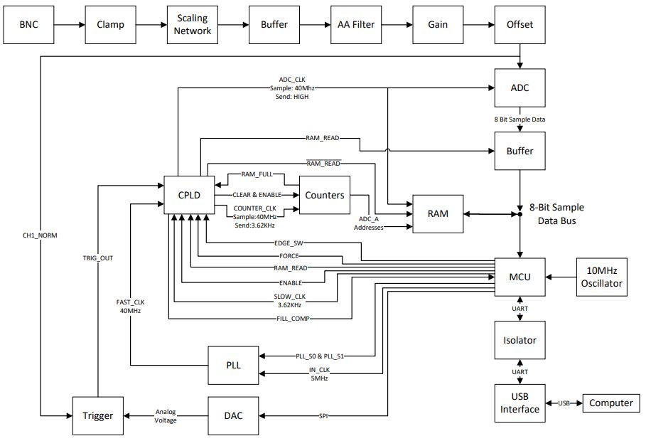

# DSO2019
Repository of a self-made Digital Oscilloscope Project. Guided by ELEN90053 Electronic System Design subject at the University of Melbourne. Printed Circuit Board designed in Altium Designer and micro-controller programmed in C on AVR Studio.

## Subsystems
Within the Digital Oscilloscope (DSO), the following subsystems are involved:

1. Front End   
    - BNC (input signal goes here)
    - Clamping Circuit   
    - Scaling Network, Buffer  
    - Anti-Aliasing Filter    
    - Offset Circuit (Level Shifter)
2. Analog to Digital Conversion Circuit      
    - Samples Analog Signals (from BNC Input) 
    - Stores sampled signals into RAM
3. RAM Circuit    
    - Sampled data is stored here  
4. Complex Programmable Logic Device (CPLD)  
    - Group of programmable logic gates that 
    - Handle and route high frequency signals in system. 
5. Input/Output (USB to UART connection) to PC  
    - Connects USB Power to Power circuit
    - Converts USB data to UART
6. Trigger   
    - Oscilloscope triggering effect.  
    (More here https://www.testandmeasurementtips.com/the-trigger-function-of-an-oscilloscope/)
7. Power  
    - Provides power supply voltage and current to overall circuit.  
    - USB Voltage to +5V, -5V conversion
    - 5V to 3.3V conversion
8. Control
    - Main brain of the entire system.
    - Micro-controller (ATMEGA-16)  
    - Buttons for Control
9. Counter Circuit 
    - Generates up to 2^16 addresses for samples to be stored in RAM.  

## System Block Diagram
Below is the planned overall block diagram of the entire oscilloscope system.

## PCB Design
Generated Top Layer of 2D PCB Design file from Altium Designer.  
  
Generated Top Layer of 3D PCB Design file from Altium Designer.  
  

